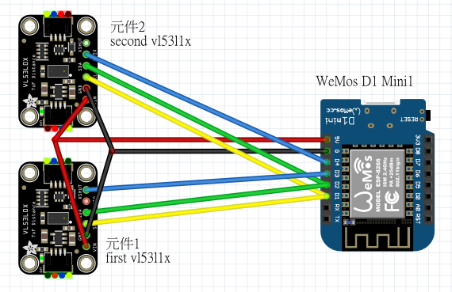

# Human in_out detector Esphome + vl53l1x
Upload two [vl53l1x](https://www.st.com/en/imaging-and-photonics-solutions/vl53l1x.html) TOF(Time of Flight) sensor data to [home assistant](https://www.home-assistant.io/) every 500ms

\
## Upload
```
esphome run in_out_polling.yaml
```
## Notes
+ [vl53l1x_PollingComponent1.h#L11](vl53l1x_PollingComponent1.h#L11) ```PollingComponent(500)``` set esphome to poll vl53l1x data every 0.5s
+ [PollingComponent](https://esphome.io/api/classesphome_1_1_polling_component.html#details)
  >This class simplifies creating components that periodically check a state.
   You basically just need to implement the update() function, it will be called every update_interval ms after startup.
   Note that this class cannot guarantee a correct timing, as it's not using timers, just a software polling feature with set_interval() from Component.
+ esphome 會依序跑完兩個[sensor](in_out_pollingComponent.yaml#L39)的setup\
  因為兩個vl53l1x共用同個i2c, vl53l1x_PollingComponent1.h的[setup()](vl53l1x_PollingComponent1.h#L13)會將兩個vl53l1x硬體(S1 & S2)的address都設成42 a.k.a. 0x2a, 也設定esphome從0x2a讀取S1的資料\
  vl53l1x_PollingComponent2.h的[setup()](vl53l1x_PollingComponent2.h#L13)透過D4(GPIO2)控制S2的XSHUT重啟S2
  ```
  # 不清楚為何使用 OUTPUT & INPUT
  pinMode(2, OUTPUT);
  pinMode(2, INPUT);  
  ```
  將S2 address還原成41 a.k.a 0x29\
  然後便可以重設S2的address, 由於S1沒有硬體reset所以這次透過i2c設定address時不受影響(optional)


## Source
[home assistant](https://www.home-assistant.io/)\
[esphome](https://esphome.io/)\
[vl53l1x-arduino](https://github.com/pololu/vl53l1x-arduino)\
[vl53l1x](https://www.st.com/en/imaging-and-photonics-solutions/vl53l1x.html)

## Reference
[jardous/tof_vl53l1x](https://github.com/jardous/tof_vl53l1x)\
[VL53L1X Can’t change address](https://forum.pololu.com/t/vl53l1x-cant-change-address/18270)
